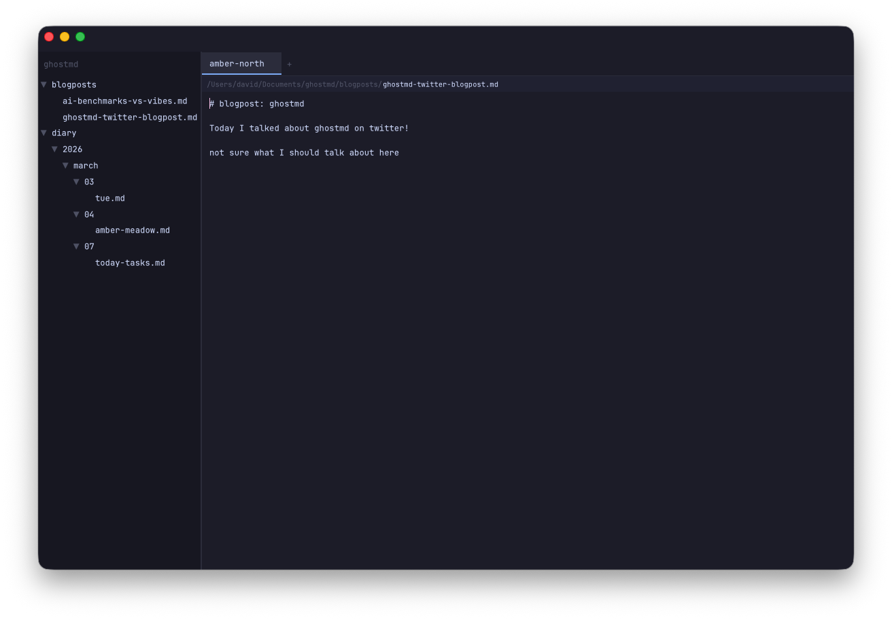
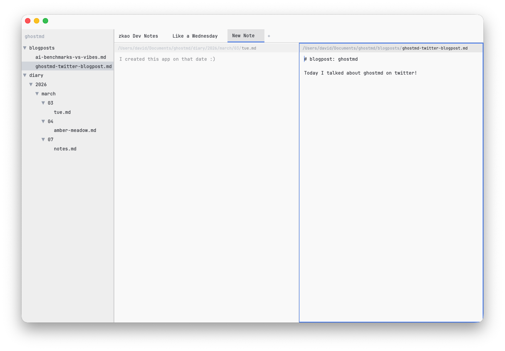

# GhostMD

A native macOS note-taking app that feels like [Ghostty](https://ghostty.org) — GPU-accelerated, keyboard-first, monospace, zero-config.

Notes are plain `.md` files in `~/Documents/ghostmd/`. No database, no lock-in. Back up the folder however you want.




## Philosophy

- **Fast path to writing**: open the app, you're typing. AI suggests a title and where to file it later.
- **Pure text**: no markdown rendering, no images. Raw monospace text like a terminal.
- **Files are the truth**: just a folder of `.md` files with whatever hierarchy you want.
- **Zero configuration**: sane defaults, no settings to fiddle with.
- **Keyboard-first**: Ghostty-style tabs/splits, Emacs text navigation, command palette.

## Install

```
curl -fsSL https://raw.githubusercontent.com/mimoo/ghostmd/main/scripts/install.sh | bash
```

This installs `GhostMD.app` to `/Applications/` and creates a `ghostmd` CLI command. Run `ghostmd update` to update.

### From source

Requires Rust 1.75+ and Xcode with Metal on macOS.

```
git clone https://github.com/mimoo/ghostmd.git
cd ghostmd
cargo build --release
./scripts/bundle-macos.sh
cp -r target/GhostMD.app /Applications/
```

### From release

Download the latest `.tar.gz` from [Releases](https://github.com/mimoo/ghostmd/releases), extract, and drag `GhostMD.app` to `/Applications/`.

## Features

- GPU-accelerated rendering via [GPUI](https://gpui.rs) (Metal on macOS)
- Branching undo tree (undo past a fork, type something new — old branch preserved)
- Auto-save on every keystroke (debounced 300ms) — quit anytime, nothing is lost
- Diary structure: new notes go to `~/Documents/ghostmd/diary/YYYY/MM/DD/`
- Always-visible file tree sidebar with expand/collapse indicators
- Fuzzy file finder (Cmd+P) with full-text content search via ripgrep
- Agentic search (Cmd+Shift+F) — ask Claude natural language questions about your notes
- Command palette (Cmd+Shift+P) with theme switching
- Ghostty-style tabs and splits with close buttons
- 19 built-in themes (15 dark, 4 light) with runtime switching via command palette
- Session persistence (tabs, splits, theme restored on relaunch)
- JetBrains Mono font

## Keyboard Shortcuts

### Notes & Files

| Action | Binding |
|--------|---------|
| New note | Cmd+N |
| New daily note (with pending items) | Cmd+Opt+N |
| Save | Cmd+S |
| Move to trash | Cmd+Backspace |
| Quit | Cmd+Q |

### Workspaces & Splits

| Action | Binding |
|--------|---------|
| New workspace | Cmd+T |
| New window | Cmd+Shift+N |
| Close pane | Cmd+W |
| Restore closed workspace | Cmd+Shift+T |
| Next workspace | Ctrl+Tab |
| Previous workspace | Ctrl+Shift+Tab |
| Jump to workspace 1–9 | Cmd+1..9 |
| Split right | Cmd+D |
| Split down | Cmd+Shift+D |
| Focus pane left/right/up/down | Opt+Cmd+Arrows |

### Search & Navigation

| Action | Binding |
|--------|---------|
| File finder | Cmd+P |
| Find in file | Cmd+F |
| Agentic search (Claude) | Cmd+Shift+F |
| Note switcher (open notes) | Cmd+Shift+A |
| Command palette | Cmd+Shift+P |
| Toggle sidebar | Cmd+B |
| Go back | Cmd+[ |
| Go forward | Cmd+] |

### Emacs Navigation

| Action | Binding |
|--------|---------|
| Beginning of line | C-a |
| End of line | C-e |
| Forward char | C-f |
| Back char | C-b |
| Forward word | Opt-f |
| Back word | Opt-b |
| Delete forward | C-d |
| Kill line | C-k |
| Yank | C-y |
| Page down | C-v |
| Page up | Opt-v |
| Beginning of buffer | Opt-< |
| End of buffer | Opt-> |

## Development

```
cargo run --release
```

## Testing

```
cargo test                  # all tests
cargo test -p ghostmd-core  # core logic + integration tests
cargo test -p ghostmd       # UI state machine tests
```

## Benchmarks

```
cargo bench -p ghostmd-core
```

Benchmarks cover buffer operations, file tree scanning (100-10K files), and fuzzy/content search at scale.

## Architecture

```
crates/
  ghostmd-core/       # Pure business logic, no UI dependency
    buffer.rs         # Rope-based text buffer with branching undo tree
    note.rs           # Note CRUD and auto-save
    diary.rs          # Date-based diary path generation
    tree.rs           # File tree model with reveal/collapse
    search.rs         # Fuzzy file search (nucleo) + content search (ripgrep)
  ghostmd/            # Native GPUI application
    app_view.rs       # Main GPUI view: workspaces, splits, overlays, search
    editor_view.rs    # GPUI editor view wrapping InputState
    file_tree_view.rs # Sidebar file tree with context menu events
    palette.rs        # Command palette state machine
    search.rs         # File finder + content search state machines
    theme.rs          # 19 themes with runtime switching
    keybindings.rs    # Keyboard shortcut definitions
```

## License

MIT
